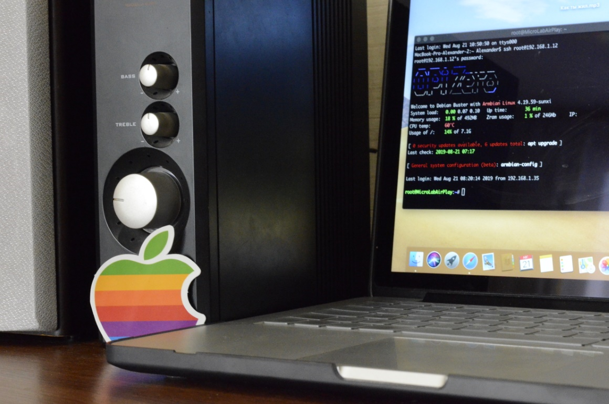

# AirPlay Orange Pi Zero
 Creating your own speakers with Airplay support.
 

An example of the work https://youtu.be/_VnSVz0QyMI

**Commands / Команды** :
   
* Run on Boot :
sudo systemctl enable shairport-sync

* Start AirPlay Service: 
sudo service shairport-sync start

* Check AirPlay Service Status: 
sudo systemctl status shairport-sync.service
